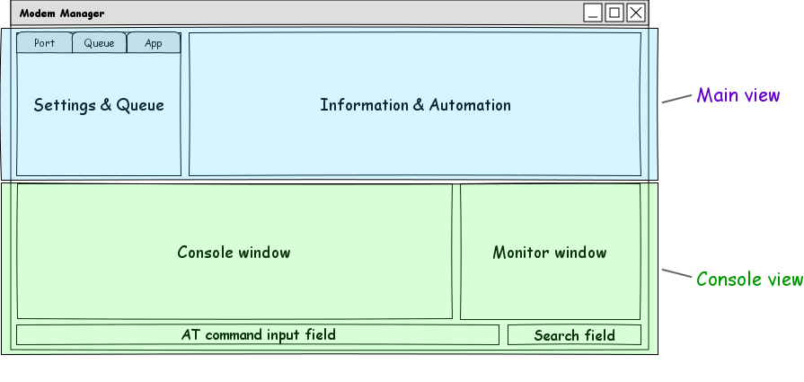
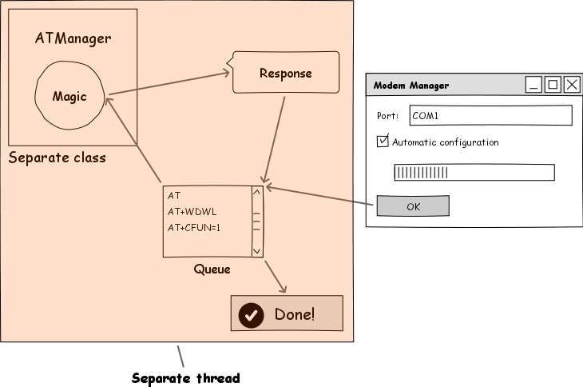

Features
========

Functionality
-------------

* Stable response from modem
* Query all information about embedded module

  + General information
  + Memory sizes
  + Firmware information

* Queue of commands

  + All commands added to one queue executed in the background thread
  + User can pause and resume commands, added to the queue
  + Queue can be automatically stopped when an error occur (if configured)
  + There is a list of current commands in the queue. Currently running command is highlighted
  + When started automatic modem configuration, queue tab can be automatically selected (if not disabled)

* Uploading firmware, using XModem protocol
* Automatic modem configuration

  + Erase application
  + Write bootloader and firmware
  + Remap memory

    - Choose both AD and FS sizes, then let automatic mapper do the work for you
    - Minimal size of AD aread is 256 MiB (for safety)
    - Visual view of mapped areas

  + Write application
  + Prepare modem for remote firmware writing
  + Sync time

Usability
---------

* Command autocompletion and suggestion based on input history
* Localization of every UI element as well as status messages
* Remember all configured settings per sessions

Visuals
-------

* Clean and filtered **Console window**

    * Command timespan
    * Colorful statuses in console

* Raw serial **Monitor window**

    * Keep all history until another port is used

* Search through both console windows
* Colorful and noticeable status boxes
* Flexible layout - windows are totally resizeable to any screen resolution, in-form splits are totally movable whenever you want. Also, you can show/hide information/console view (F11/F12)
* Progressbar shows file uploading

Keyboard shortcuts
------------------

Global:

+--------+------------------------------+
| F11    | Hide / show **Main** view    |
+--------+------------------------------+
| F12    | Hide / show **Console** view |
+--------+------------------------------+
| Ctrl-F | Focus search field           |
+--------+------------------------------+
| Ctrl-L | Clear console                |
+--------+------------------------------+
| Ctrl-S | Save all settings            |
+--------+------------------------------+

Command input field:

+--------+----------------------------------+
| Return | Send command                     |
+--------+----------------------------------+
| Ctrl-Z | Send data in download mode (sub) |
+--------+----------------------------------+

Development
-----------

* Clean code base and architecture
* Minimal dependencies
* Threading: all the work done in the background thread, UI does not freeze
* Separate classes do separate work
* Constructive comments for most code blocks
* Code enclosed in #regions for clarity
