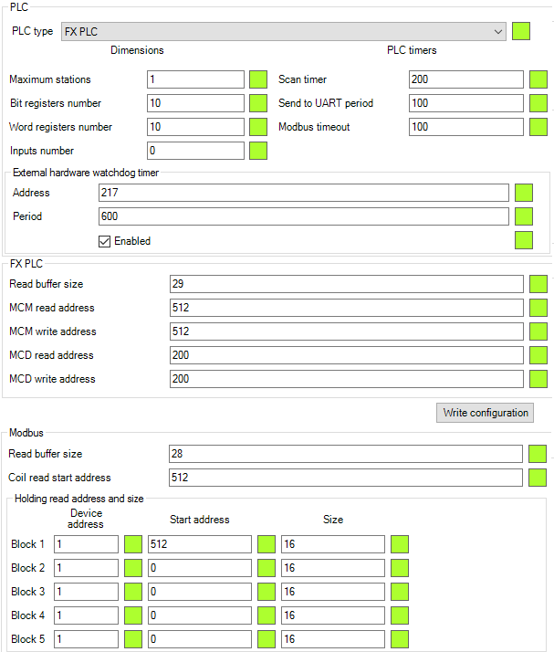

Использование
=============

.. role:: i
.. role:: s

.. contents:: Содержание

Установка соединения
--------------------

Когда Вы первый раз откроете программу, Вы увидите следующее окно.

При запуске, все доступные в системе порты обновляются и добавляются в список портов :i:`1`. Вы можете вручную обновить список доступных портов, после добавления новых устройств, нажатием кнопки **"Открыть порт"** :i:`2`.

После выбора необходимого порта, выберите (или введите) необходимую скорость передачи данных (baud rate) для выбранного устройства :i:`3`. Установите флажок **"Заполнить автоматически"** :i:`4` если Вы хотите чтобы программа заполнила информацию о модеме автоматически при подключении к устройству. Также в любой момент можно сделать это вручную используя кнопку **"Заполнить информацию"** :i:`5`. Тот же результат может быть получен нажатием горячей клавиши :s:`F5` (обновить информацию, см. :ref:`key-shortcuts`).

Для подключения к модему нажмите кнопку **"Открыть порт"** :i:`6`. Если порт был успешно открыт, индикатор текущего статуса :i:`7` станет зелёным. Индикатор статуса может быть трех разных цветов: красный при закрытом порту, зелёный - при открытом, синий - в режиме *"загрузки"*.

В нижней части окна располагается консольный монитор. Левая :i:`8` часть отвечает за красивые статусные сообщения и фильтрованный вывод AT-команд, правая :i:`9` часть является монитором последовательного COM-соединения и отображает всё что попадает в COM-порт.

Текстовое поле :i:`10` в самом низу позволяет слать AT-команды модему напрямую. Текстовое поле :i:`11` осуществляет поиск по обоим консольным окнам.

.. image:: Screens/Search.png

.. note::

   Поиск работает не инкрементально: он лишь подсвечивает все совпадения для удобного просмотра результатов.

.. _queue:

Очередь команд
--------------

При общении с модемом, будь то ручные команды или автоматическая кнопка настройки модема, AT-команды складываются в *"очередь"* команд. Очередь можно приостанавливать и возобнавлять, а также повторять последнюю (неудавшуюся) команду.

.. image:: Screens/Queue.png

.. note::

   Если флажок **"Автоматически показывать очередь"** (в настройках) включен, вкладка очереди будет автоматически открыта когда автоматизированный набор команд будет запущен на исполнение (см. :ref:`settings`).

На скриншоте отображён список команд, появившихся после запуска конфигурирования приложения модема (см. :ref:`configuration`). Текущая работающая команда подсвечена зелёным цветом если это AT-команда, и синим цветом если это длительный процесс (загрузка прошивки по протоколу XModem, перенастройка аналоговых и цифровых входов).

Флажок **"Автопауза"** :i:`1` отвечает за приостановку очереди в случае возникновения ошибок при выполнении команды. В большинстве сценариев, этот влажок должен быть активен.

Кнопка **"Пауза/Продолжить"** :i:`2` позволяет вручную приостановить/возобновить очередь. Если очередь приостановлена, Вы всё ещё можете посылать модему AT-команды, которые будут выполнены сразу же после ввода в параллельной (другой) очереди, работающей без остановок специально для этого применения.

Кнопка **"Повторить"** :i:`3` позволяет повторить последнюю (неудавшуюся) AT-команду если очередь в данный момент приостановлена. Эта команда исполняется в параллельной очереди, позволяя заменить ввод одной и той же команды вручную.

Индикатор состояния :i:`4` нужен для отображения прогресса долгих событий (таких как загрузка прошивки или перенастройка большого количества портов).

.. _settings:

Настройки ModemManager
----------------------

Для более комфортной работы с программой Вы можете настроить её удовлетворяющим Вас образом. Для этого перейдите на вкладку **"Настройки"** :i:`1`. Если Вы желаете пропустить часть по настройке программы, можете перейти к части :ref:`preparation`.

Выпадающий список **"Язык приложения"** :i:`2` позволяет выбрать язык всего приложения. Локализация включает не только перевод интерфейса, но также перевод всех сообщений, статусов и т. п. На текущий момент доступны два языка: английский и русский.

В списке **"Автодополнение"** :i:`3` можно выбрать тип автодополнения при вводе ручных AT-команд. Всего есть 4 типа дополнения:

.. image:: Screens/Autocomplete.png

:i:`8` - Нет

:i:`9` - Всплывающая подсказка

:i:`10` - Дополнение в строке

:i:`11` - Подсказка и дополнение

.. note::

   Автодополнение использует историю вводимых команд. При запуске программы список пуст, т. е. автодополнения по всем AT-командам нету.

Флажок **"Автоматически показывать очередь"** :i:`4` делает именно то, что говорит: открывает вкладку **"Очередь"** при старте выполнения длинной очереди команд для того, чтобы Вы могли видеть что происходит в данный момент.

Флажок **"Раскраска COM-монитора"** :i:`5` улучшает вид вывода монитора последовательного порта (справа снизу) путём раскраски "синтаксиса" отдельных частей, например оранжевый - для текста в кавычках.

.. image:: Screens/ColorizedCOM.png

Флажок **"Сохранить настройки при выходе"** :i:`6` необходим для сохранение всевозможных статусов и установленных настроек приложения между сессиями. Если Вы хотите запретить изменение настроек, снимите эту галочку и приложение будет начинать каждый раз с теми же настройками (текущими сохранёнными).

.. warning::

   Программа не сохранит настройку **"Сохранять настройки при выходе"** если флажок снят. Чтобы намеренно сохранить эту настройку, используйте горячее сочетание клавиш :s:`Ctrl` :s:`S`, которое позволяет сохранять настройки в любой момент времени (см. :ref:`key-shortcuts`).

И, наконец, кнопка **"Сбросить настройки"** :i:`7` сбрасывает все возможные настроки на их стандартные значения без возможности возврата :)

.. _preparation:

Подготовка к работе
-------------------

Перед началом использования модема, необходимо подготовить его для работы. Если у Вас есть чистый модем без нашего приложения последней версии, или Вы желаете обновить приложение до последней версии, или не был настроен APN sim-карты, необходимо сделать следующее:

:i:`1` Переразбить внутреннюю память модема (место под приложение и файловую систему) если Вам это необходимо.

:i:`2` Настроить внешнюю (интернет) APN для sim-карты.

:i:`3` Удостовериться, что необходимые флажки активны.

:i:`4` Установить этот флажок если Вы хотите обновить внутреннее время модема и обновить (получить снова) информацию о модеме после выполнения всех действий.

:i:`5` Нажать кнопку **"Начать"** для старта автоматического процесса подготовки модема. Очередь (см. :ref:`queue`) будет заполнена необходимыми командами и начнёт настройку модема.

Если Вы хотите обновить приложение (прошивку) (или загрузить его первый раз), нажмите кнопку **"Обновление из облака"** :i:`6`. Процесс обновления приложения из облака не до конца явный, потому как Вам вероятно придётся обходить некоторые ошибки вводом команд вручную. Если Вы обнаружите какие-либо ошибки, обратите внимание к разделу :ref:`troubleshooting`.

.. note::

   APN должен быть настроен хотя бы один раз, т. к. процедура настройки APN также ПАТЧИТ модем для правильной работы.

.. _configuration:

Конфигурирование приложения модема
----------------------------------

Configuring application only works if you have our application inside your modem (which is obvious).

:i:`1` button fills information from modem.

:i:`2` button fills information from XML config file. You can get such file with predefined settings and just load whole configuration from it.

:i:`3` button saves current on-screen configuration into XML file for future use.

:i:`4` button resets default configuration which is defined by the version of application you are using.

:i:`5` button configures all on-screen configuration into modem.

Reference manual for sections :i:`6` - :i:`13` will be added in future.

.. _troubleshooting:

Проблемы и их решение
---------------------

При попытке обновления из облака возникает ошибка
~~~~~~~~~~~~~~~~~~~~~~~~~~~~~~~~~~~~~~~~~~~~~~~~~

If error occurred before ``at+wdss=1,1`` command is executed, it most likely happened because you have no SIM card installed. Please, check that you have SIM card installed and that your modem have reliable internet connection (correct APN is set).

Also, make sure that your modem is patched (see :ref:`preparation`). APN must be configured at least once.

Can't send command error is sometimes occurs, nothing helps unless application is restarted
~~~~~~~~~~~~~~~~~~~~~~~~~~~~~~~~~~~~~~~~~~~~~~~~~~~~~~~~~~~~~~~~~~~~~~~~~~~~~~~~~~~~~~~~~~~

This is major bug with USB communication and it can occur sometimes based on Windows configuration, drivers configuration and modem configuration. This is hardware related question and low-level COM communication question, which will not be resolved in close time.

If you made your configuration in **"Configuration"** tab and then this error occured, you can just save whole configuration into XML file, restart application and load this configuration from XML file.
