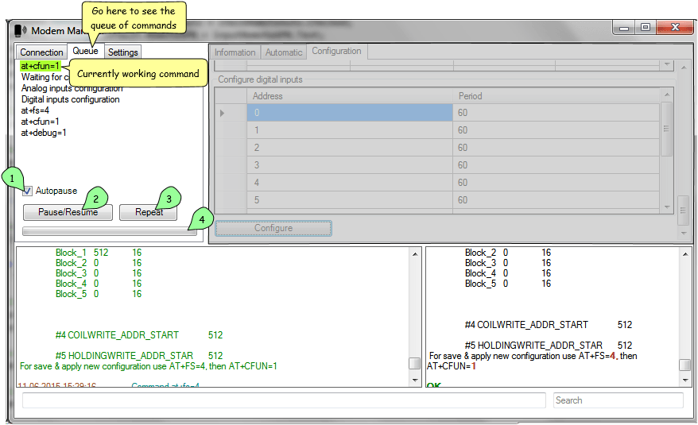

Usage
=====

.. role:: i
.. role:: s

.. contents::

Starting communication
----------------------

When you first open the program, you see main window.

.. image:: Screens/MainForm.png

At start, all available ports should be updated and filled in ports list :i:`1`. You can manually refresh them after inserting new devices by clicking **"Rescan"`** :i:`2` button.

After choosing needed port, select (or input) serial port speed (baud rate) for given device :i:`3`. Check or uncheck **"Fill automatically"** :i:`4` checkbox: if it is checked, all information about modem will be filled automatically after you have connected to modem. You can also fill information manually using **"Fill information"** :i:`5` button. The same result could be achieved by using :s:`F5` key (refresh information, see :ref:`key-shortcuts`).

Click **"Open port"** :i:`6` button to start communication. If port has been successfully opened, status indicator :i:`7` will turn green. This status indicator could be 3 different colors: red for closed, green for opened, blue for *"downloading mode"*.

There's console view at the bottom of the window. Left view :i:`8` is for pretty status messages and filtered AT-command results, where right view :i:`9` is raw COM (serial) monitor which displays all that present in COM connection.

Text field :i:`10` at the bottom allows to send AT commands explicitly into modem and text field **"Search"** :i:`11` allows to search through both console windows.

.. image:: Screens/Search.png

.. note::

   Search does not work incrementally: it just highlights all found matches so you can see them distinctly.

But before you actually use program, you may wish to setup it for your demands. To do so, go to **"Settings"** tab at the top left corner. If you wish to skip settings chapter, go to :ref:`Updating firmware` section.

.. _queue:

Using queue
-----------

Whether you are using console input or automatized button which processes number of tasks, these tasks will be added into the queue of commands which you can see, pause, resume and repeat.

.. note::

   If you have **"Autofocus queue"** enabled in settings, this tab will be automatically opened when automatized sequence of commands is triggered (see :ref:`settings`).

Here you can see list of commands that appeared after clicking **"Configure"** button (see :ref:`configuration`). Currently working command is highlighted by green color if it is AT-command and by blue color if it is a process which uses progressbar below (XModem uploading, analog/digital inputs configuration).

Checkbox **"Autopause"** :i:`1` makes sure that if an error occurs when command is executed, whole queue would be paused and you will be notified of that. In most cases, this checkbox should be enabled.

Button **"Pause/Resume"**  :i:`2` explicitely pause/resume queue. State of the queue will be printed in console view (bottom left). If the queue is paused, you can still input new AT commands which will be immediately executed in second (parallel) queue which is always working in non-pausing mode for this case specially.

Button **"Repeat"** :i:`3` allows to repeat last failed AT-command if the queue is currently paused. This command is repeated in second queue, so this is just an automation around typing the same command again and again.

Progressbar :i:`4` is needed for indicating progress of long events (such as downloading firmware or configuring lots of ports).

.. _settings:

ModemManager settings
---------------------

Before using the program, you may wish to setup it for your demands. To do so, go to **"Settings"** :i:`1` tab.

.. image:: Screens/Settings.png

In listbox **"Application language"** :i:`2` you can choose whole application language between two languages (currently): english and russian. This localizes not only user interface, but also various status messages in console view.

In listbox **"AT autocompletion"** :i:`3` you can select autocompletion type for manual AT-command input from 4 different types:

.. image:: Screens/Autocomplete.png

:i:`8` - None

:i:`9` - Suggest

:i:`10` - Append

:i:`11` - Suggest and append

.. note::

   Autocompletion uses history of used AT-commands. There's no predefined list of commands.

Checkbox **"Autofocus queue"** :i:`4` does exactly what it promises to do: it focuses **"Queue"** tab (see :ref:`queue`) when automatized queue of commands is started, so that you can see whole queue coming and going.

**"Colorize COM monitor"** :i:`5` checkbox improves look and feel of raw COM monitor at the bottom right side of application. It actually colorized input based on some rules, like orange for "quoted text".

Checkbox **"Save settings on exit"** :i:`6` is needed for saving settings and state of the application between sessions. If you want to start from current setup all the time, just uncheck this checkbox and if you change any settings, they will not remain after restart.

.. warning::

   The program will not save **"Save settings on exit"** option if it is unchecked. To explicitely save it you should use :s:`Ctrl` :s:`S` shortcut to manually save current settings (see :ref:`key-shortcuts`).

And finally, button **"Reset defaults"** :i:`7` resets all configurations to its default values without possibility to return :)

Updating application firmware
-----------------------------

Before start using modem, you should configure APN for your simcard and install latest version of our application firmware.

.. _configuration:

Application configuration
-------------------------
